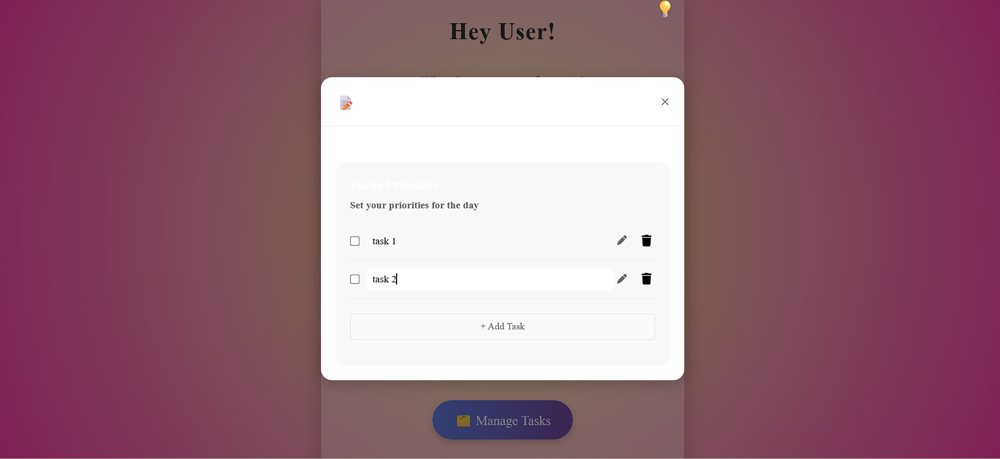

Flocus – Focus Timer with Task Management

📌 Description

Flocus is a simple and interactive productivity web application designed to help users stay focused using a timer-based workflow (Pomodoro technique). It also allows users to manage daily tasks, switch themes, and maintain productivity with a clean and engaging interface.

🚀 Features
Focus, Short Break, and Long Break timer modes
Task management (Add, delete, mark as completed)
Displays current active task
Dynamic theme selection (Aura & Nature themes)
Alarm sound and custom alert when time is up
Confetti animation for completion feedback
Editable timer (click minutes/seconds to customize time)
Responsive and user-friendly UI

🛠️ Tech Stack
HTML
CSS
JavaScript
📸 Screenshots

🏠 Home Page

✅ Task Management

🎨 Background Design

▶️ How to Run
Download or clone the repository
Open the project folder
Run focustime.html in your browser

Folder Structure
project-folder/
│── focustime.html   # Main HTML file  
│── styles.css       # Styling for UI  
│── script.js        # Functionality and logic  
│── images/          # Screenshots and assets  

🙌 Author
Jayasri
